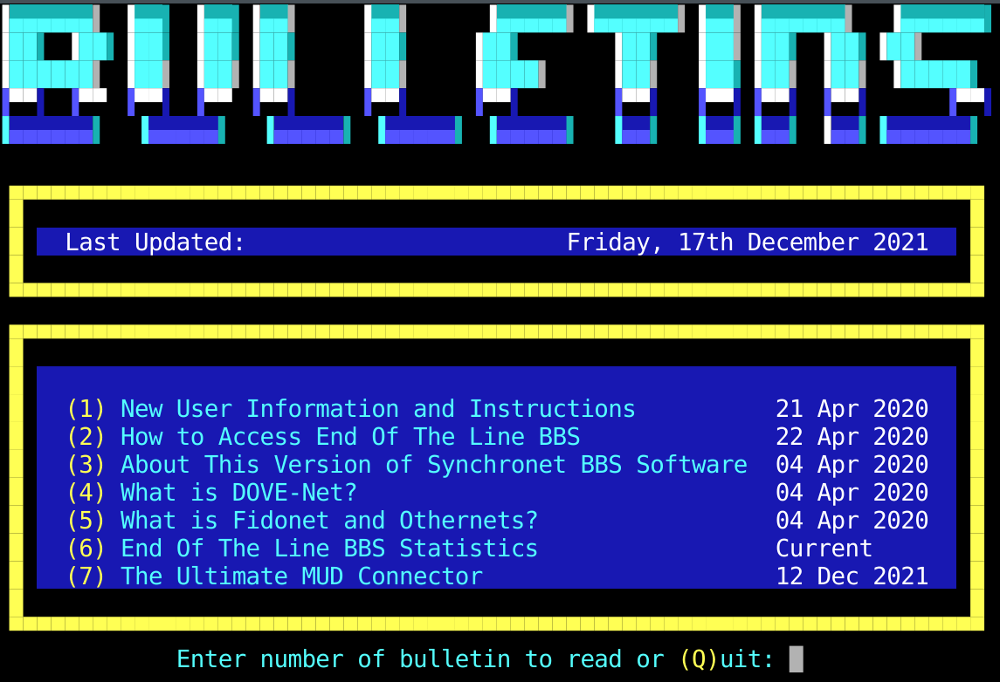

# Using C-Kermit to connect to a DOS BBS

DOS BBSs typically use the DOS CP437 character set, while modern terminals use
UTF-8.  The line-drawing characters often used on a DOS BBS won't show up
properly on a terminal expecting UTF-8.

C-Kermit can translate live.  It also supports the XModem, YModem, and ZModem
protocols often used for file transfer by BBSs (you may need to install a
package called lrzsz or rzsz to enable this.)

A single command enables character set translation in both directions:

```
SET TERMINAL CHARACTER-SET CP437 UTF8
```

## How it works

- `SET TERMINAL CHARACTER-SET <remote-cs> [<local-cs>]` sets the
  remote host's character set and C-Kermit's local character set.
  If two different sets are given, C-Kermit
  translates between them during CONNECT.  By default both are
  TRANSPARENT and no translation happens.

- CP437 is a first-class character set with its own glyph tables including
  line-drawing characters.

- UTF-8 is likewise first-class (`FC_UTF8`, ckuxla.c:508).

- Translation set by this command is bidirectional. Bytes received from the BBS
  (CP437) are converted to UTF-8 for display, and keystrokes typed locally
  (UTF-8) are converted to CP437 before being sent to the BBS, where possible
  (UTF-8 supports many more different characters than CP437).

## Commands

```
SET TERMINAL CHARACTER-SET CP437 UTF8
TELNET bbs.example.com
```

or

`SSH username@bbs.example.com`

## Local terminal configuration

You'll want a local terminal that has good support for ANSI.  Then size it to
precisely 80x24 (or sometimes 80x25).

I have found [Konsole](https://apps.kde.org/konsole/) to work well, but there
are certainly others also.

I configured a Konsole BBS profile like this:

- Appearance category
  - Color scheme & font tab
    - Linux Colors
    - Draw intense colors in bold font unchecked
  - Miscellaneous tab
    - Show hint for terminal size after resizing checked
  - Advanced tab
    - Allow blinking text checked
    
Here's an example screenshot:



## Notes and caveats

- The local terminal must actually be UTF-8 (check `locale`) for the
  translated output to render correctly.

- `SHOW TERMINAL` displays the current character-set settings.

- `SET TERMINAL CHARACTER-SET ?` lists all supported character sets.

- On POSIX, the combined `SET TERMINAL CHARACTER-SET <remote> <local>` form is
  the normal way to configure this. The more granular `SET TERMINAL
  REMOTE-CHARACTER-SET` / `SET TERMINAL LOCAL-CHARACTER-SET` pair also exists
  (documented alongside it in ckuus2.c) if asymmetric behavior is ever needed,
  e.g. translating received data but leaving typed keystrokes untouched.

- You will want a terminal with good support for ANSI emulation to run this all
  in.
